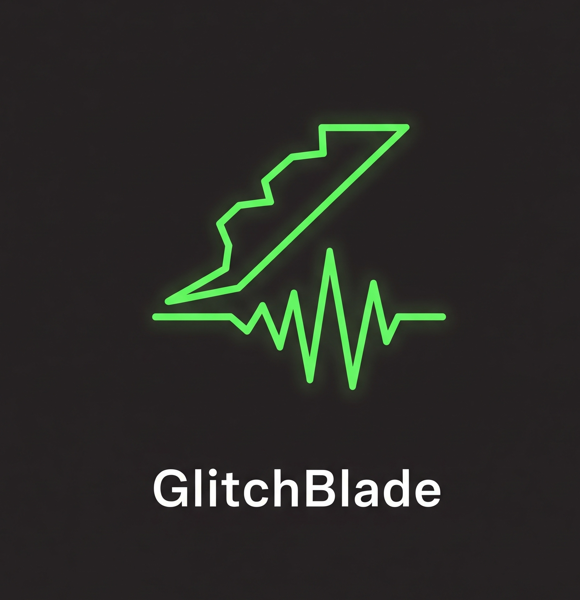

# GLITCHBLADE

<div align="center">
  
</div>

A web-based audio sampler and glitch instrument built with React, TypeScript, and the Web Audio API. Transform any audio file into a playable 12-pad sampler with real-time effects and automatic transient detection.


## Features

### 🎵 Core Functionality

- **Audio File Loading**: Drag and drop audio files directly into the browser
- **Automatic Transient Detection**: Intelligently detects transients and creates slices based on amplitude threshold
- **12-Pad Sampler Grid**: 4x3 grid layout for triggering audio slices
- **Interactive Waveform Display**: Visualize your audio with draggable slice markers
- **Real-time Playback**: Low-latency audio playback with micro-fades to prevent clicks

### 🎛️ Audio Effects

- **BitCrusher**: Digital distortion effect with adjustable bit depth (1-16 bits)
- **Low-Pass Filter**: Smooth filtering with adjustable cutoff frequency (20-20000 Hz) and resonance
- **Delay**: Echo effect with configurable delay time (0.01-1.0s) and feedback
- **Pitch Control**: Adjustable playback rate (0.1x - 2.0x)
- **Reverse Playback**: Flip audio slices backwards

### 🎮 Control Methods

- **Keyboard Mapping**: 
  - Row 1: `Q`, `W`, `E`, `R`
  - Row 2: `A`, `S`, `D`, `F`
  - Row 3: `Z`, `X`, `C`, `V`
- **MIDI Support**: Connect MIDI controllers (maps from MIDI note 36/C2)
- **Mouse Interaction**: Click on waveform or pad grid to trigger slices
- **Drag & Drop**: Drag slice markers on the waveform to reposition them

### ⚡ Special Modes

- **Chaos Mode**: Automatically triggers random slices at a configurable BPM (60-200)
- **Master Compressor**: Built-in dynamics compressor prevents clipping and ensures clean audio output

## Tech Stack

- **React 19** - UI framework
- **TypeScript** - Type safety
- **Vite** - Build tool and dev server
- **Tailwind CSS** - Styling with custom cyberpunk theme
- **Web Audio API** - Audio processing and playback
- **Lucide React** - Icon library

## Getting Started

### Prerequisites

- Node.js 18+ and npm

### Installation

1. Clone the repository:
```bash
git clone <repository-url>
cd GlitchBlade
```

2. Install dependencies:
```bash
npm install
```

3. Start the development server:
```bash
npm run dev
```

4. Open your browser and navigate to the URL shown in the terminal (typically `http://localhost:5173`)

### Building for Production

```bash
npm run build
```

The production build will be in the `dist` directory.

## Usage

1. **Load Audio**: Drag and drop an audio file (WAV, MP3, etc.) into the browser window
2. **Adjust Threshold**: Use the threshold slider to control how many slices are detected
3. **Edit Slices**: Hover over slice markers on the waveform and drag to reposition them
4. **Trigger Slices**: 
   - Press keyboard keys (Q-V)
   - Click on pads in the grid
   - Click on the waveform
   - Use a MIDI controller
5. **Apply Effects**: Toggle and adjust effects in the Effect Controls panel
6. **Activate Chaos Mode**: Enable chaos mode for automatic random slice triggering at your set BPM

## Project Structure

```
GlitchBlade/
├── src/
│   ├── components/
│   │   ├── Controls.tsx          # Main controls (threshold, BPM, volume, chaos)
│   │   ├── EffectControls.tsx    # Audio effects panel
│   │   ├── PadGrid.tsx           # 12-pad sampler grid
│   │   └── WaveformDisplay.tsx   # Interactive waveform visualization
│   ├── lib/
│   │   └── AudioEngine.ts        # Core audio processing engine
│   ├── App.tsx                   # Main application component
│   └── main.tsx                  # Application entry point
├── public/                       # Static assets
└── dist/                         # Production build output
```

## Audio Engine

The `AudioEngine` class handles all audio processing:

- **Audio Loading**: Decodes audio files into `AudioBuffer` objects
- **Transient Detection**: Uses RMS (Root Mean Square) analysis to detect transients
- **Slice Playback**: Creates `AudioBufferSourceNode` instances with configurable effects
- **Effect Chain**: Dynamically builds audio effect chains (bitcrusher, filter, delay)
- **Master Compression**: Applies dynamics compression to prevent clipping

## Browser Compatibility

- Chrome/Edge (recommended)
- Firefox
- Safari (with Web Audio API support)

**Note**: MIDI support requires a browser that supports the Web MIDI API (Chrome, Edge, Opera).

## Development

### Available Scripts

- `npm run dev` - Start development server
- `npm run build` - Build for production
- `npm run preview` - Preview production build
- `npm run lint` - Run ESLint

### Customization

The UI uses a custom cyberpunk theme defined in Tailwind CSS. Colors can be customized in `tailwind.config.js`:

- `cyber-primary`: Main accent color (cyan/green)
- `cyber-secondary`: Secondary accent (purple)
- `cyber-accent`: Accent color (pink/red)
- `cyber-panel`: Panel background
- `cyber-dark`: Dark background

## Future Improvements

The following features are planned for future releases:

### 🎚️ Additional Audio Effects
- **Reverb**: Convolution reverb for spatial effects
- **Distortion/Saturation**: Analog-style saturation and overdrive
- **Chorus/Flanger**: Modulation effects for movement and depth
- **High-Pass and Band-Pass Filters**: More filter options beyond low-pass
- **Granular Synthesis**: Time-stretching and granular manipulation

### 💾 Project Management
- **Save/Load Presets**: Save effect settings and slice configurations
- **Export Audio**: Record and export your performances as WAV files
- **Sample Library**: Manage multiple samples and switch between them
- **Undo/Redo**: History system for slice editing operations

### 🎹 Enhanced Playback
- **Sequencer/Pattern Playback**: Record and loop sequences of slice triggers
- **Velocity Sensitivity**: MIDI velocity control for volume and effects
- **Polyphonic Playback**: Play multiple slices simultaneously
- **Time-Stretching**: Independent pitch and tempo control
- **ADSR Envelope**: Attack, Decay, Sustain, Release controls per slice

### 🎛️ Advanced Controls
- **Customizable Keyboard Mapping**: Remap keys to your preference
- **MIDI CC Mapping**: Map MIDI continuous controllers to effect parameters
- **Per-Pad Effects**: Individual effect settings for each pad
- **Macro Controls**: Link multiple parameters to single controls
- **Keyboard Shortcuts**: Hotkeys for common operations

### 🔍 Improved Detection & Editing
- **Advanced Transient Detection**: Spectral analysis and machine learning-based detection
- **Manual Slice Creation**: Add/remove slices with precise control
- **Slice Quantization**: Snap slices to musical time divisions
- **Visual Feedback**: Enhanced waveform visualization with spectral view
- **Multi-Track Support**: Load and layer multiple audio files

### 🎨 UI/UX Enhancements
- **Theme Customization**: User-selectable color themes
- **Responsive Design**: Better mobile and tablet support
- **Accessibility**: Screen reader support and keyboard navigation
- **Performance Monitor**: Real-time CPU and memory usage display
- **Tutorial Mode**: Interactive guide for new users

### 🔧 Technical Improvements
- **AudioWorklet Migration**: Replace deprecated ScriptProcessor with AudioWorklet
- **WebAssembly DSP**: High-performance audio processing with WASM
- **Offline Rendering**: Non-realtime audio processing for complex effects
- **PWA Support**: Progressive Web App for offline use
- **Cloud Sync**: Sync presets and samples across devices

## License

MIT License - see LICENSE file for details

## Contributing

Contributions are welcome! Please feel free to submit a Pull Request.

---

**GLITCHBLADE** - Transform audio into glitched-out sonic mayhem 🎵⚡
